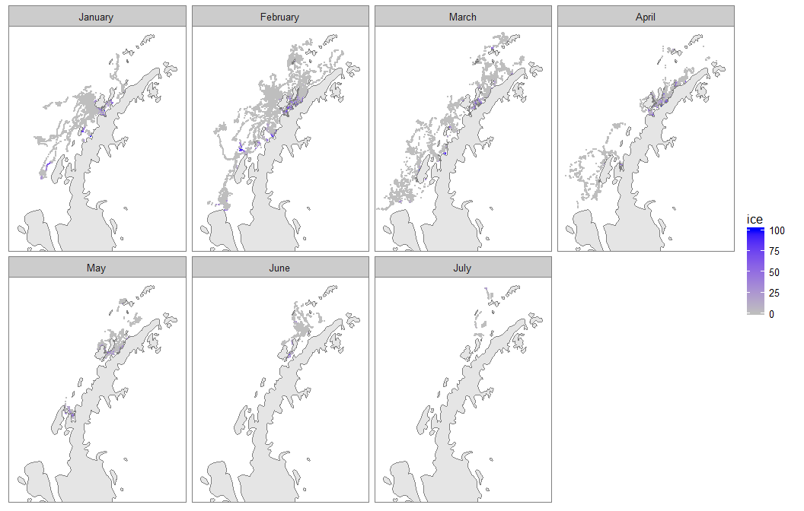
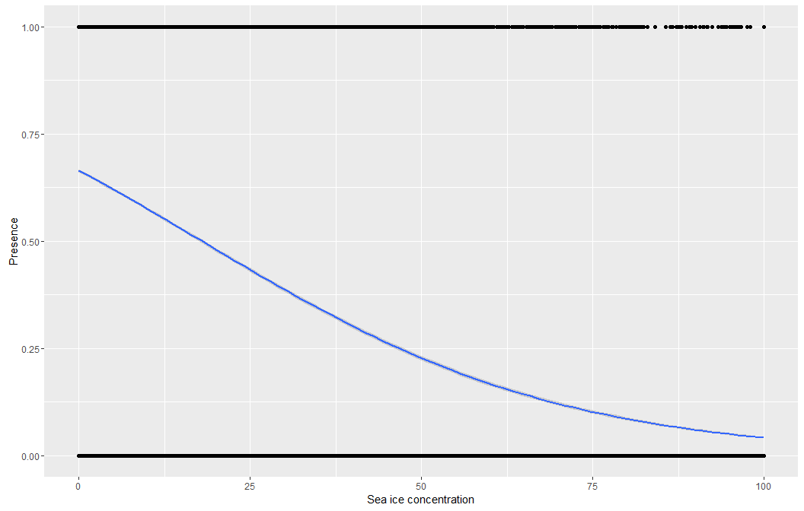

# Humpback distribution and sea ice
Ben Weinstein  
February 21, 2017  

#Argos Observations

# Dive Data

# Geographic Data
<!-- -->

## Bind the geographic and dive data

## Occupancy and ice concentration.

What is the probability of occupancy of a cell as a function of % ice cover.

Associate each argos location with ice cell.

<!-- -->

<!-- -->

# Null models

## Random use

Null use map

For each day, sample randomly in the background points for null values of sea ice concentration.

<!-- --><!-- -->

## Temperal window

Sample the cells in a sliding window

* we are allowed to sample any cells that have been occupied in the dataset, we know that whales can disperse to those sites. This ignores the inhenerent spatial autocorrelation in movement.

