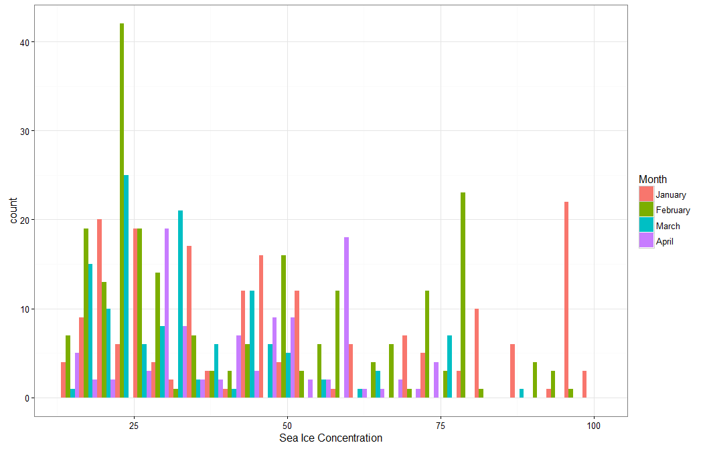
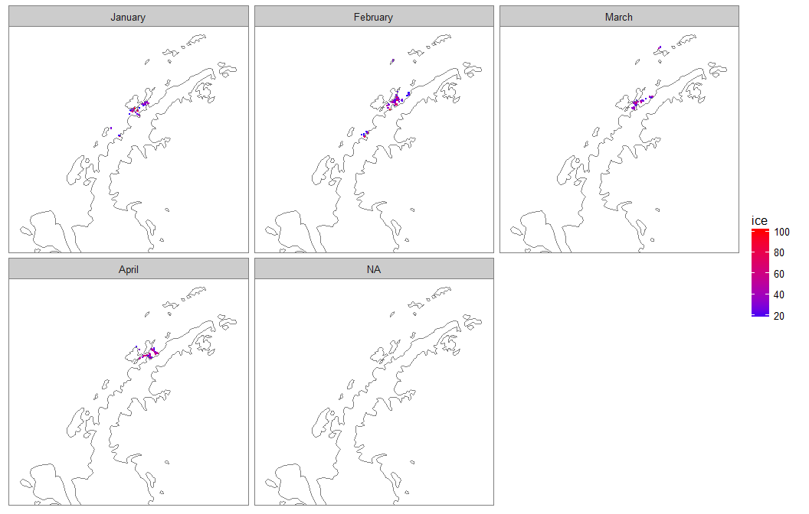
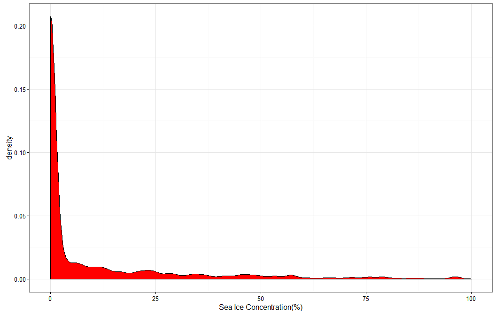
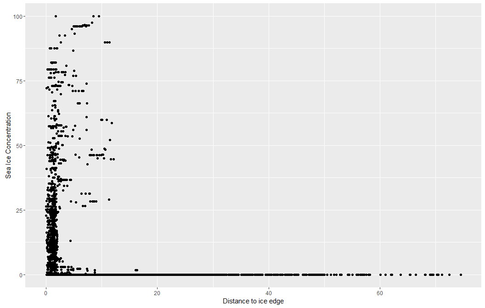
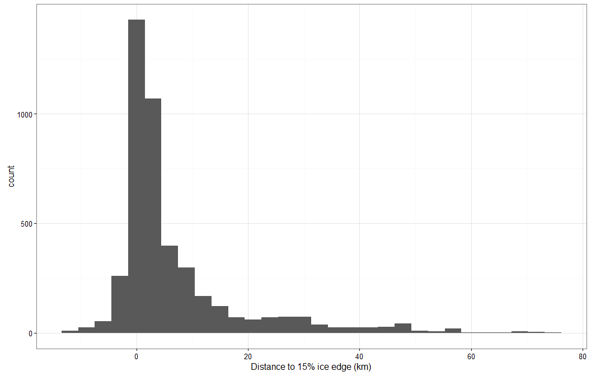

# Humpback distribution and sea ice
Ben Weinstein  
February 21, 2017  

# Project Description 
  
  * Global changes in climate will lead to new environments
  
  * A key question is how sensitive animals are to changes in environmental conditions
  
  * When favorable conditions arise, how quickly can animals respond to the availability of new habitat?
  
  * Polar marine ecosystems are particularly vulnerable, given the pronounced effects of climate on local conditions, variable environments, and lack of information on species distributions
  
  * We evaluate the response of two cetacean species to changes in sea-ice cover.
  
##	Our aims

  * Sea ice trends, by month, over the last 5 years

  * Determine the threshold of sea-ice concentration and proximity on whale presence
  
  * Evaluate the phenology of sea-ice timing and whale movement
  
  * Highlight anomalous sea ice conditions  
  * % Change in available habitat based on variable ice conditions

# Occupancy and ice concentration.

What is the probability of occupancy of a cell as a function of % ice cover.

Associate each argos location with ice cell.

<!-- --><!-- --><!-- -->

<!-- --><!-- -->

##Time integration

Each observation is not independent. In the above analysis a whale popping up 4 times in an hour will recieve the same weight as 4 observations in one day. One approach is to take the average ice concentration among observations and multiply it be the time difference.

<!-- -->

# Null models

## Random use

Null use map

For each day, sample randomly in the background points for null values of sea ice concentration.

<!-- --><!-- -->

#Distance to ice edge

<!-- -->

<!-- --><!-- -->

# Temperal window

Sample the cells in a sliding window

* we are allowed to sample any cells that have been occupied in the dataset, we know that whales can disperse to those sites. This ignores the inhenerent spatial autocorrelation in movement.

