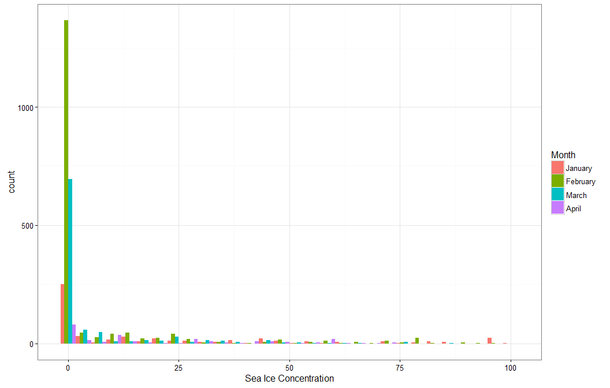
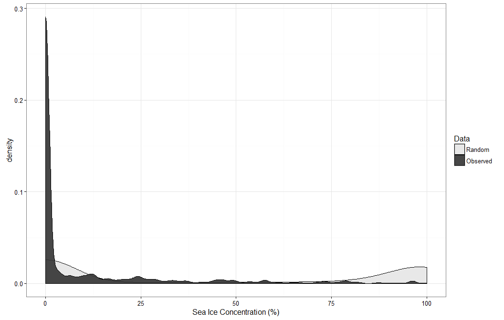
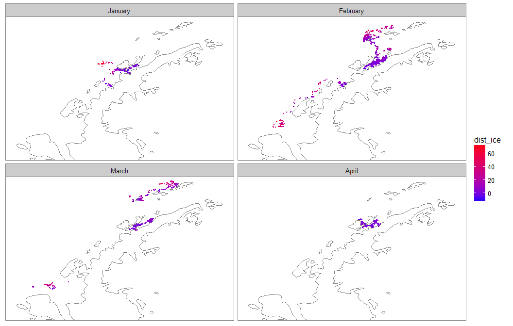

# Humpback distribution and sea ice
Ben Weinstein  
February 21, 2017  

#Argos Observations

## Occupancy and ice concentration.

What is the probability of occupancy of a cell as a function of % ice cover.

Associate each argos location with ice cell.

<!-- --><!-- --><!-- -->

<!-- --><!-- -->

##Time integration

Each observation is not independent. In the above analysis a whale popping up 4 times in an hour will recieve the same weight as 4 observations in one day. One approach is to take the average ice concentration among observations and multiply it be the time difference.

<!-- --><!-- -->

# Null models

## Random use

Null use map

For each day, sample randomly in the background points for null values of sea ice concentration.

<!-- --><!-- -->

## Temperal window

Sample the cells in a sliding window

* we are allowed to sample any cells that have been occupied in the dataset, we know that whales can disperse to those sites. This ignores the inhenerent spatial autocorrelation in movement.

#Distance to ice edge

<!-- --><!-- -->

